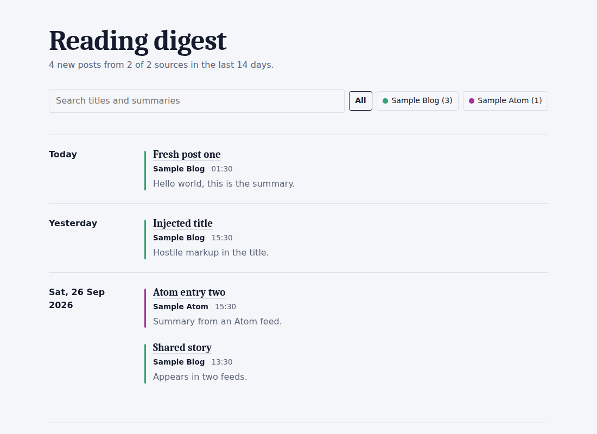

# Newsletter digest

A reading page that builds itself. Twice a week, a GitHub Action reads the blogs and newsletters you follow and publishes one clean page of what's new, grouped by day, searchable and filterable by source. Every run also writes a dated Markdown snapshot into [`digests/`](digests), so there's a permanent, browsable history on GitHub even though the live page only ever shows a rolling window.

No server, no database, no accounts, no cost. The whole thing is one Python file, a feed list, and a workflow.



*Preview built from the test fixtures. Your page will show your own feeds.*

## Set it up

1. **Create your own copy.** Click **Use this template** if this repo is a template, or fork it, or copy the files into a new public repo.
2. **Turn on GitHub Pages.** In your repo go to **Settings → Pages** and set **Source** to **GitHub Actions**.
3. **Add your feeds.** Edit [`feeds.json`](feeds.json) (see below) and commit.
4. **Run it once.** Open the **Actions** tab, pick **Build and publish digest**, and click **Run workflow**.
5. Your page appears at `https://bunker-commits.github.io/newsletter-digest/` after the run finishes. It then refreshes itself every day.

## Configure

Everything lives in `feeds.json`:

```json
{
  "title": "Reading digest",
  "days": 5,
  "max_per_feed": 15,
  "timezone": "Asia/Kolkata",
  "feeds": [
    { "name": "Where's Your Ed At", "url": "https://www.wheresyoured.at/rss/" },
    { "name": "Farnam Street", "url": "https://fs.blog/feed/" }
  ]
}
```

`days` is set to 5 by default here so it covers the gap between twice-weekly runs, with a little buffer.

| Setting | Meaning | Default |
| --- | --- | --- |
| `title` | Heading of the page | `Reading digest` |
| `days` | How far back to look | `14` |
| `max_per_feed` | Most recent posts to keep from each feed | `15` |
| `timezone` | Used to group posts into days and show times ([list](https://en.wikipedia.org/wiki/List_of_tz_database_time_zones)) | `UTC` |
| `feeds` | List of `{ "name", "url" }`. `name` is optional | required |

**Finding a feed URL.** Try adding `/feed`, `/rss` or `/rss.xml` to a blog's address. Ghost sites use `/rss/`, WordPress sites use `/feed/`, and Substack newsletters use `/feed`. Or look for an RSS link in the page source.

**Change the schedule.** It's currently set to run every Monday and Thursday at 07:00 IST (01:30 UTC). Edit the `cron` line in [`.github/workflows/digest.yml`](.github/workflows/digest.yml) to change it — times are in UTC.

## Run it locally

```bash
pip install -r requirements.txt
python digest.py --archive-dir digests   # writes site/index.html and digests/<date>.md
open site/index.html                     # macOS; use xdg-open on Linux
```

Run the tests with `python -m unittest discover -s tests -v`.

## How it works

```
                     ┌──► site/index.html ──► GitHub Pages (rebuilt fresh each run, never committed)
feeds.json ──► digest.py
                     └──► digests/<date>.md ──► committed to the repo (permanent history)
                 ▲
     GitHub Actions (Mon & Thu cron)
```

1. `digest.py` downloads all feeds in parallel, with a 20 second timeout each.
2. It keeps posts from the last `days` days, drops duplicates (the same link from two feeds), and sorts newest first.
3. It renders a single self-contained HTML page with the styles and a small script for search and filtering — this is deployed via GitHub Pages and rebuilt fresh each run, so it's never committed and your git history stays clean.
4. It also renders a dated Markdown snapshot (`digests/2026-09-29.md`, say) of the same run. That file *is* committed, so browsing the `digests/` folder on GitHub gives you a permanent, dated archive of every run, even though the live page only ever shows a rolling window.
5. The workflow tests the code, builds both outputs, commits any change to `digests/`, and deploys the page.

## Design decisions

- **Feeds are untrusted input.** Titles and summaries are reduced to plain text, then HTML-escaped when rendered. Only `http` and `https` links are kept, so a feed can't inject a `javascript:` link. This is covered by tests.
- **One bad feed doesn't break the page.** A feed that times out or isn't valid is listed at the bottom of the page and skipped.
- **A run where every feed fails does not publish.** The workflow fails instead, so yesterday's good page stays online rather than being replaced by an empty one.
- **Timezone-aware days.** "Today" and "Yesterday" follow your configured timezone, not the server's.
- **No build step, one dependency.** The only package is `feedparser`. Everything else is the Python standard library.

## Limitations

- Feeds only include what publishers put in them. Some show a full post, some a short excerpt, and some paywalled newsletters show only a teaser.
- GitHub can delay scheduled runs by several minutes, and it **pauses scheduled workflows in a public repo after 60 days without any repo activity**. If your page stops updating, open the Actions tab and re-enable the workflow, or push any small commit.
- Email-only newsletters with no RSS feed can't be read by this tool.

## Ideas for extending it

- Import an OPML file exported from a feed reader
- Publish the digest as its own RSS feed
- Mark posts as read (stored in the browser)
- Send a weekly summary by email
- Add short AI-written summaries of each post

## License

MIT. See [LICENSE](LICENSE).
